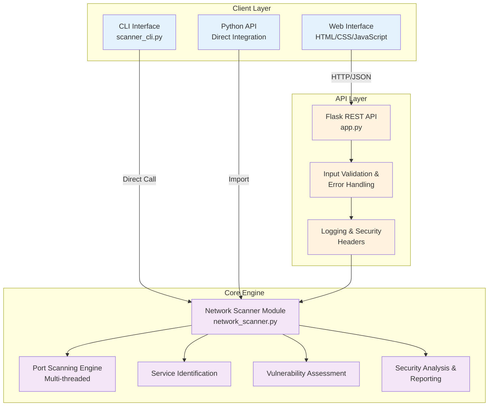
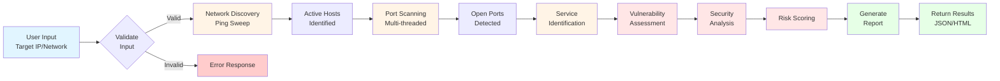
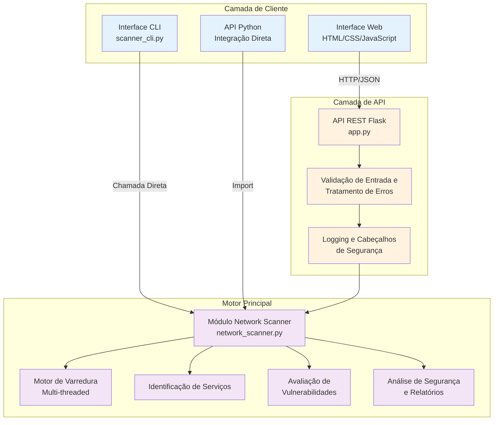

# Network Security Scanner

[English](#english) | [Português](#português)

## English

### Overview

[](https://www.python.org/)
[](https://flask.palletsprojects.com/)
[](https://opensource.org/licenses/MIT)
[](https://github.com/galafis/Network-Security-Scanner)
[](https://github.com/galafis/Network-Security-Scanner)

Advanced network security scanner built with Python and Flask. Features comprehensive network discovery, vulnerability scanning, port analysis, and security assessment capabilities for identifying potential security risks in network infrastructure.

### Screenshots

#### Web Interface - Main Dashboard


*Modern web interface for configuring and executing network security scans*

#### Scan Results View


*Comprehensive scan results showing open ports, services, and vulnerability assessments*

#### Security Analysis


*Real-time security analysis with risk scoring and actionable recommendations shown in scan results*

### Features
- **Network Discovery**: Automatic network device discovery
- **Port Scanning**: Comprehensive port analysis and service detection
- **Vulnerability Assessment**: Security vulnerability identification
- **Service Fingerprinting**: Detailed service and version detection
- **Security Reporting**: Comprehensive security assessment reports
- **Real-time Monitoring**: Live network security monitoring
- **Custom Scan Profiles**: Configurable scanning parameters
- **Export Capabilities**: Multiple report export formats
- **CLI Interface**: Powerful command-line interface for automation
- **REST API**: Full-featured API for integration
- **Web Dashboard**: User-friendly web interface
- **Multi-threaded Scanning**: Fast concurrent port scanning
- **Input Validation**: Comprehensive input validation and error handling
- **Logging**: Detailed logging for audit trails

### Technologies Used
- **Python 3.8+**: Core programming language
- **Flask**: Web framework and REST API
- **Flask-CORS**: Cross-Origin Resource Sharing support
- **Socket**: Low-level network communication
- **Threading**: Concurrent port scanning
- **ipaddress**: Network address manipulation
- **JSON**: Configuration and reporting format
- **HTML/CSS/JavaScript**: Modern web interface
- **pytest**: Testing framework

### Architecture



### Scan Workflow

The following diagram illustrates the complete scanning process from input to report generation:



### Installation

#### Prerequisites
- Python 3.8 or higher
- pip (Python package manager)
- Virtual environment (recommended)

#### Step-by-Step Installation

1. **Clone the repository:**
```bash
git clone https://github.com/galafis/Network-Security-Scanner.git
cd Network-Security-Scanner
```

2. **Create and activate a virtual environment (recommended):**
```bash
# On Linux/Mac
python3 -m venv venv
source venv/bin/activate

# On Windows
python -m venv venv
venv\Scripts\activate
```

3. **Install dependencies:**
```bash
pip install -r requirements.txt
```

4. **Configure environment variables (optional):**
```bash
cp .env.example .env
# Edit .env file with your preferred settings
```

5. **Run the application:**
```bash
python app.py
```

6. **Access the web interface:**
Open your browser to `http://localhost:5000`

### Running Tests

The project includes comprehensive unit and integration tests.

**Run all tests:**
```bash
python3 -m pytest test_network_scanner.py test_app.py -v
```

**Run specific test file:**
```bash
# Backend scanner tests
python3 -m pytest test_network_scanner.py -v

# Flask app tests
python3 -m pytest test_app.py -v
```

**Run with coverage:**
```bash
python3 -m pytest --cov=network_scanner --cov=app --cov-report=html
```

**Using unittest (alternative):**
```bash
python3 -m unittest discover -v
```

### Usage

#### Command Line Interface (CLI)

The scanner provides a powerful CLI for terminal-based scanning.

**Basic host scan:**
```bash
python3 scanner_cli.py -t 192.168.1.1
```

**Scan hostname:**
```bash
python3 scanner_cli.py -t example.com
```

**Network range scan:**
```bash
python3 scanner_cli.py -t 192.168.1.0/24 --network
```

**Scan specific ports:**
```bash
python3 scanner_cli.py -t 192.168.1.1 -p 80,443,8080,3306
```

**Save results to JSON file:**
```bash
python3 scanner_cli.py -t 192.168.1.1 -o results.json
```

**JSON output mode:**
```bash
python3 scanner_cli.py -t 192.168.1.1 --json
```

**Quiet mode (no banner):**
```bash
python3 scanner_cli.py -t 192.168.1.1 -q
```

**Custom timeout:**
```bash
python3 scanner_cli.py -t 192.168.1.1 --timeout 2
```

#### Web Interface
1. **Target Configuration**: Set scan targets and parameters
2. **Scan Execution**: Run network security scans
3. **Results Analysis**: Review scan results and vulnerabilities
4. **Report Generation**: Create detailed security reports
5. **Monitoring Dashboard**: Real-time network security status

#### API Endpoints

The scanner provides a REST API for programmatic access.

**Health Check**
```bash
curl -X GET http://localhost:5000/health
```

Response:
```json
{
  "status": "healthy",
  "service": "Network Security Scanner"
}
```

**Start Network Scan**
```bash
curl -X POST http://localhost:5000/scan \
  -H "Content-Type: application/json" \
  -d '{"target": "192.168.1.0/24", "scan_type": "network"}'
```

**Scan Single Host**
```bash
curl -X POST http://localhost:5000/scan \
  -H "Content-Type: application/json" \
  -d '{"target": "192.168.1.1", "scan_type": "host"}'
```

**Scan with Hostname**
```bash
curl -X POST http://localhost:5000/scan \
  -H "Content-Type: application/json" \
  -d '{"target": "example.com", "scan_type": "host"}'
```

Response Example:
```json
{
  "host": "example.com",
  "ip": "93.184.216.34",
  "timestamp": "2024-01-15T10:30:00.123456",
  "open_ports": [80, 443],
  "closed_ports": [21, 22, 23],
  "services": {
    "80": "HTTP",
    "443": "HTTPS"
  },
  "vulnerabilities": [
    {
      "type": "Unencrypted Web Traffic",
      "severity": "Medium",
      "description": "HTTP traffic is not encrypted",
      "recommendation": "Use HTTPS with valid SSL/TLS certificate"
    }
  ],
  "security_analysis": {
    "risk_level": "Medium",
    "score": 80,
    "recommendations": [
      "Use encrypted alternatives (HTTPS, SFTP, SSH)",
      "Regular security audits recommended"
    ]
  }
}
```

#### Python API
```python
from network_scanner import NetworkScanner

# Initialize scanner
scanner = NetworkScanner()

# Discover network devices
devices = scanner.scan_network("192.168.1.0/24")

# Scan specific host
results = scanner.scan_host(
    host="192.168.1.100",
    ports=[21, 22, 80, 443],
    timeout=2
)

# Print results
print(results)
```

### Scanning Features

#### Network Discovery
- **Ping Sweep**: Live host detection
- **ARP Discovery**: Local network device discovery
- **DNS Resolution**: Hostname resolution
- **Network Mapping**: Network topology visualization

#### Port Scanning
- **TCP Connect Scan**: Full TCP connection scanning
- **SYN Scan**: Stealth SYN scanning
- **UDP Scan**: UDP port scanning
- **Service Detection**: Service and version identification

#### Vulnerability Assessment
- **Common Vulnerabilities**: CVE database integration
- **Configuration Issues**: Security misconfigurations
- **Weak Credentials**: Default password detection
- **Outdated Services**: Version vulnerability analysis

#### Security Analysis
- **Open Ports**: Unnecessary open port identification
- **Service Banners**: Service information gathering
- **SSL/TLS Analysis**: Certificate and encryption analysis
- **Firewall Detection**: Firewall rule analysis

### Scan Types

#### Quick Scan
- **Fast Discovery**: Rapid network overview
- **Common Ports**: Top 100 most common ports
- **Basic Services**: Essential service detection
- **Quick Assessment**: High-level security overview

#### Comprehensive Scan
- **Full Port Range**: All 65535 ports
- **Detailed Analysis**: In-depth service analysis
- **Vulnerability Checks**: Complete vulnerability assessment
- **Performance Impact**: Thorough but slower scanning

#### Stealth Scan
- **Low Profile**: Minimal network footprint
- **Evasion Techniques**: IDS/IPS evasion
- **Fragmented Packets**: Packet fragmentation
- **Timing Control**: Scan timing optimization

#### Custom Scan
- **User-Defined**: Custom scan parameters
- **Flexible Targets**: Multiple target formats
- **Selective Ports**: Specific port ranges
- **Advanced Options**: Expert configuration

### Security Reports

#### Executive Summary
- **Risk Overview**: High-level security assessment
- **Critical Issues**: Priority security concerns
- **Recommendations**: Immediate action items
- **Compliance Status**: Security standard compliance

#### Technical Details
- **Vulnerability List**: Detailed vulnerability information
- **Port Analysis**: Open port security assessment
- **Service Information**: Service configuration details
- **Remediation Steps**: Technical fix instructions

#### Compliance Reports
- **PCI DSS**: Payment card industry compliance
- **HIPAA**: Healthcare security requirements
- **SOX**: Sarbanes-Oxley compliance
- **Custom Standards**: Organization-specific requirements

### Monitoring Dashboard

#### Real-time Status
- **Active Scans**: Currently running scans
- **Network Health**: Overall network security status
- **Alert Summary**: Security alerts and warnings
- **Performance Metrics**: Scan performance statistics

#### Historical Analysis
- **Trend Analysis**: Security posture trends
- **Vulnerability Tracking**: Vulnerability lifecycle
- **Remediation Progress**: Fix implementation tracking
- **Compliance Monitoring**: Ongoing compliance status

### Configuration
Configure scanner settings in `config.py` and environment variables.

### Security Considerations

#### Legal and Ethical Use
- **Authorized Use Only**: Only scan networks you own or have explicit written permission to test
- **Legal Compliance**: Follow all local, state, and federal laws regarding network scanning
- **Responsible Disclosure**: Report discovered vulnerabilities responsibly to affected parties
- **Professional Ethics**: Use this tool only for legitimate security assessment purposes

#### Best Practices
- **Network Impact**: Schedule scans during low-usage periods to minimize network disruption
- **Rate Limiting**: Use appropriate timeouts and delays to avoid overwhelming target systems
- **Documentation**: Keep detailed records of all scans performed, including authorization
- **Data Protection**: Secure scan results containing sensitive information
- **Regular Updates**: Keep the scanner and all dependencies updated for security patches

#### Security Recommendations
- **Use HTTPS**: Always use HTTPS in production environments
- **Authentication**: Implement authentication for the web interface in production
- **Access Control**: Restrict access to the scanner to authorized personnel only
- **Logging**: Monitor and review scan logs regularly for unusual activity
- **Encryption**: Use encrypted channels when transmitting scan results

#### Disclaimer
This tool is provided for educational and authorized security assessment purposes only. Users are solely responsible for ensuring their use of this tool complies with all applicable laws and regulations. The authors assume no liability for misuse or damage caused by this tool.

### Integration
- **SIEM Systems**: Security information and event management
- **Vulnerability Management**: Integration with vulnerability scanners
- **Ticketing Systems**: Automatic ticket creation for issues
- **Compliance Tools**: Integration with compliance platforms

### Contributing

We welcome contributions! Please see [CONTRIBUTING.md](CONTRIBUTING.md) for detailed guidelines.

Quick start:
1. Fork the repository
2. Create a feature branch (`git checkout -b feature/new-feature`)
3. Make your changes with tests
4. Commit your changes (`git commit -am 'Add new feature'`)
5. Push to the branch (`git push origin feature/new-feature`)
6. Create a Pull Request

For bug reports, feature requests, or questions, please open an issue on GitHub.

### License
This project is licensed under the MIT License - see the [LICENSE](LICENSE) file for details.

### Author

**Gabriel Demetrios Lafis**
- GitHub: [@galafis](https://github.com/galafis)
- LinkedIn: [Gabriel Demetrios Lafis](https://linkedin.com/in/gabriel-lafis)

---

## Português

### Visão Geral

[](https://www.python.org/)
[](https://flask.palletsprojects.com/)
[](https://opensource.org/licenses/MIT)
[](https://github.com/galafis/Network-Security-Scanner)
[](https://github.com/galafis/Network-Security-Scanner)

Scanner avançado de segurança de rede construído com Python e Flask. Apresenta descoberta abrangente de rede, varredura de vulnerabilidades, análise de portas e capacidades de avaliação de segurança para identificar potenciais riscos de segurança na infraestrutura de rede.

### Capturas de Tela

#### Interface Web - Painel Principal


*Interface web moderna para configurar e executar varreduras de segurança de rede*

#### Visualização de Resultados da Varredura


*Resultados abrangentes mostrando portas abertas, serviços e avaliações de vulnerabilidades*

#### Análise de Segurança


*Análise de segurança em tempo real com pontuação de risco e recomendações acionáveis mostradas nos resultados da varredura*

### Funcionalidades
- **Descoberta de Rede**: Descoberta automática de dispositivos de rede
- **Varredura de Portas**: Análise abrangente de portas e detecção de serviços
- **Avaliação de Vulnerabilidades**: Identificação de vulnerabilidades de segurança
- **Fingerprinting de Serviços**: Detecção detalhada de serviços e versões
- **Relatórios de Segurança**: Relatórios abrangentes de avaliação de segurança
- **Monitoramento em Tempo Real**: Monitoramento de segurança de rede ao vivo
- **Perfis de Varredura Personalizados**: Parâmetros de varredura configuráveis
- **Capacidades de Exportação**: Múltiplos formatos de exportação de relatórios
- **Interface CLI**: Interface de linha de comando poderosa para automação
- **API REST**: API completa para integração
- **Painel Web**: Interface web amigável
- **Varredura Multi-threaded**: Varredura rápida e concorrente de portas
- **Validação de Entrada**: Validação abrangente de entrada e tratamento de erros
- **Logging**: Logging detalhado para trilhas de auditoria

### Tecnologias Utilizadas
- **Python 3.8+**: Linguagem de programação principal
- **Flask**: Framework web e API REST
- **Flask-CORS**: Suporte para Cross-Origin Resource Sharing
- **Socket**: Comunicação de rede de baixo nível
- **Threading**: Varredura concorrente de portas
- **ipaddress**: Manipulação de endereços de rede
- **JSON**: Formato de configuração e relatórios
- **HTML/CSS/JavaScript**: Interface web moderna
- **pytest**: Framework de testes

### Arquitetura



### Fluxo de Varredura

O diagrama a seguir ilustra o processo completo de varredura desde a entrada até a geração de relatórios:

```mermaid
flowchart LR
    A[Entrada do Usuário<br/>IP/Rede Alvo] --> B{Validar<br/>Entrada}
    B -->|Válido| C[Descoberta de Rede<br/>Ping Sweep]
    B -->|Inválido| Z[Resposta de Erro]
    C --> D[Hosts Ativos<br/>Identificados]
    D --> E[Varredura de Portas<br/>Multi-threaded]
    E --> F[Portas Abertas<br/>Detectadas]
    F --> G[Identificação<br/>de Serviços]
    G --> H[Avaliação de<br/>Vulnerabilidades]
    H --> I[Análise de<br/>Segurança]
    I --> J[Pontuação<br/>de Risco]
    J --> K[Gerar<br/>Relatório]
    K --> L[Retornar Resultados<br/>JSON/HTML]
    
    style A fill:#e1f5ff
    style C fill:#fff4e6
    style E fill:#fff4e6
    style G fill:#fff4e6
    style H fill:#ffe6e6
    style I fill:#ffe6e6
    style J fill:#ffe6e6
    style K fill:#e6ffe6
    style L fill:#e6ffe6
    style Z fill:#ffcccc
```



### Instalação

#### Pré-requisitos
- Python 3.8 ou superior
- pip (gerenciador de pacotes Python)
- Ambiente virtual (recomendado)

#### Instalação Passo a Passo

1. **Clone o repositório:**
```bash
git clone https://github.com/galafis/Network-Security-Scanner.git
cd Network-Security-Scanner
```

2. **Crie e ative um ambiente virtual (recomendado):**
```bash
# No Linux/Mac
python3 -m venv venv
source venv/bin/activate

# No Windows
python -m venv venv
venv\Scripts\activate
```

3. **Instale as dependências:**
```bash
pip install -r requirements.txt
```

4. **Configure as variáveis de ambiente (opcional):**
```bash
cp .env.example .env
# Edite o arquivo .env com suas configurações preferidas
```

5. **Execute a aplicação:**
```bash
python app.py
```

6. **Acesse a interface web:**
Abra seu navegador em `http://localhost:5000`

### Executando Testes

O projeto inclui testes unitários e de integração abrangentes.

**Executar todos os testes:**
```bash
python3 -m pytest test_network_scanner.py test_app.py -v
```

**Executar arquivo de teste específico:**
```bash
# Testes do scanner backend
python3 -m pytest test_network_scanner.py -v

# Testes da aplicação Flask
python3 -m pytest test_app.py -v
```

**Executar com cobertura:**
```bash
python3 -m pytest --cov=network_scanner --cov=app --cov-report=html
```

**Usando unittest (alternativa):**
```bash
python3 -m unittest discover -v
```

### Uso

#### Interface de Linha de Comando (CLI)

O scanner fornece uma CLI poderosa para varreduras baseadas em terminal.

**Varredura básica de host:**
```bash
python3 scanner_cli.py -t 192.168.1.1
```

**Varredura de nome de host:**
```bash
python3 scanner_cli.py -t example.com
```

**Varredura de faixa de rede:**
```bash
python3 scanner_cli.py -t 192.168.1.0/24 --network
```

**Varredura de portas específicas:**
```bash
python3 scanner_cli.py -t 192.168.1.1 -p 80,443,8080,3306
```

**Salvar resultados em arquivo JSON:**
```bash
python3 scanner_cli.py -t 192.168.1.1 -o resultados.json
```

**Modo de saída JSON:**
```bash
python3 scanner_cli.py -t 192.168.1.1 --json
```

**Modo silencioso (sem banner):**
```bash
python3 scanner_cli.py -t 192.168.1.1 -q
```

**Timeout personalizado:**
```bash
python3 scanner_cli.py -t 192.168.1.1 --timeout 2
```

#### Interface Web
1. **Configuração de Alvo**: Defina alvos e parâmetros de varredura
2. **Execução da Varredura**: Inicie varreduras de segurança de rede
3. **Análise de Resultados**: Revise os resultados da varredura e vulnerabilidades
4. **Geração de Relatórios**: Crie relatórios detalhados de segurança
5. **Painel de Monitoramento**: Status de segurança de rede em tempo real

#### Endpoints da API

O scanner fornece uma API REST para acesso programático.

**Verificação de Saúde**
```bash
curl -X GET http://localhost:5000/health
```

Resposta:
```json
{
  "status": "healthy",
  "service": "Network Security Scanner"
}
```

**Iniciar Varredura de Rede**
```bash
curl -X POST http://localhost:5000/scan \
  -H "Content-Type: application/json" \
  -d '{"target": "192.168.1.0/24", "scan_type": "network"}'
```

**Varredura de Host Único**
```bash
curl -X POST http://localhost:5000/scan \
  -H "Content-Type: application/json" \
  -d '{"target": "192.168.1.1", "scan_type": "host"}'
```

**Varredura com Nome de Host**
```bash
curl -X POST http://localhost:5000/scan \
  -H "Content-Type: application/json" \
  -d '{"target": "example.com", "scan_type": "host"}'
```

Exemplo de Resposta:
```json
{
  "host": "example.com",
  "ip": "93.184.216.34",
  "timestamp": "2024-01-15T10:30:00.123456",
  "open_ports": [80, 443],
  "closed_ports": [21, 22, 23],
  "services": {
    "80": "HTTP",
    "443": "HTTPS"
  },
  "vulnerabilities": [
    {
      "type": "Unencrypted Web Traffic",
      "severity": "Medium",
      "description": "HTTP traffic is not encrypted",
      "recommendation": "Use HTTPS with valid SSL/TLS certificate"
    }
  ],
  "security_analysis": {
    "risk_level": "Medium",
    "score": 80,
    "recommendations": [
      "Use encrypted alternatives (HTTPS, SFTP, SSH)",
      "Regular security audits recommended"
    ]
  }
}
```

#### API Python
```python
from network_scanner import NetworkScanner

# Inicializar scanner
scanner = NetworkScanner()

# Descobrir dispositivos de rede
dispositivos = scanner.scan_network("192.168.1.0/24")

# Varredura de host específico
resultados = scanner.scan_host(
    host="192.168.1.100",
    ports=[21, 22, 80, 443],
    timeout=2
)

# Imprimir resultados
print(resultados)
```

### Recursos de Varredura

#### Descoberta de Rede
- **Ping Sweep**: Detecção de hosts ativos
- **Descoberta ARP**: Descoberta de dispositivos de rede local
- **Resolução DNS**: Resolução de nomes de host
- **Mapeamento de Rede**: Visualização da topologia de rede

#### Varredura de Portas
- **Varredura TCP Connect**: Varredura completa de conexão TCP
- **Varredura SYN**: Varredura SYN furtiva
- **Varredura UDP**: Varredura de portas UDP
- **Detecção de Serviços**: Identificação de serviços e versões

#### Avaliação de Vulnerabilidades
- **Vulnerabilidades Comuns**: Integração com banco de dados CVE
- **Problemas de Configuração**: Configurações de segurança incorretas
- **Credenciais Fracas**: Detecção de senhas padrão
- **Serviços Desatualizados**: Análise de vulnerabilidade de versão

#### Análise de Segurança
- **Portas Abertas**: Identificação de portas abertas desnecessárias
- **Banners de Serviço**: Coleta de informações de serviço
- **Análise SSL/TLS**: Análise de certificados e criptografia
- **Detecção de Firewall**: Análise de regras de firewall

### Tipos de Varredura

#### Varredura Rápida
- **Descoberta Rápida**: Visão geral rápida da rede
- **Portas Comuns**: As 100 portas mais comuns
- **Serviços Básicos**: Detecção de serviços essenciais
- **Avaliação Rápida**: Visão geral de segurança de alto nível

#### Varredura Abrangente
- **Faixa Completa de Portas**: Todas as 65535 portas
- **Análise Detalhada**: Análise aprofundada de serviços
- **Verificações de Vulnerabilidade**: Avaliação completa de vulnerabilidades
- **Impacto no Desempenho**: Varredura completa, mas mais lenta

#### Varredura Furtiva
- **Baixo Perfil**: Mínima pegada de rede
- **Técnicas de Evasão**: Evasão de IDS/IPS
- **Pacotes Fragmentados**: Fragmentação de pacotes
- **Controle de Tempo**: Otimização do tempo de varredura

#### Varredura Personalizada
- **Definida pelo Usuário**: Parâmetros de varredura personalizados
- **Alvos Flexíveis**: Múltiplos formatos de alvo
- **Portas Seletivas**: Intervalos de portas específicas
- **Opções Avançadas**: Configuração especializada

### Relatórios de Segurança

#### Resumo Executivo
- **Visão Geral de Risco**: Avaliação de segurança de alto nível
- **Problemas Críticos**: Preocupações de segurança prioritárias
- **Recomendações**: Itens de ação imediata
- **Status de Conformidade**: Conformidade com padrões de segurança

#### Detalhes Técnicos
- **Lista de Vulnerabilidades**: Informações detalhadas sobre vulnerabilidades
- **Análise de Portas**: Avaliação de segurança de portas abertas
- **Informações de Serviço**: Detalhes de configuração de serviço
- **Etapas de Remediação**: Instruções técnicas de correção

#### Relatórios de Conformidade
- **PCI DSS**: Conformidade com o padrão da indústria de cartões de pagamento
- **HIPAA**: Requisitos de segurança de saúde
- **SOX**: Conformidade com Sarbanes-Oxley
- **Padrões Personalizados**: Requisitos específicos da organização

### Painel de Monitoramento

#### Status em Tempo Real
- **Varreduras Ativas**: Varreduras em execução no momento
- **Saúde da Rede**: Status geral de segurança da rede
- **Resumo de Alertas**: Alertas e avisos de segurança
- **Métricas de Desempenho**: Estatísticas de desempenho da varredura

#### Análise Histórica
- **Análise de Tendências**: Tendências da postura de segurança
- **Rastreamento de Vulnerabilidades**: Ciclo de vida das vulnerabilidades
- **Progresso da Remediação**: Rastreamento da implementação de correções
- **Monitoramento de Conformidade**: Status de conformidade contínuo

### Configuração
Configure as configurações do scanner em `config.py` e variáveis de ambiente.

### Considerações de Segurança

#### Uso Legal e Ético
- **Uso Autorizado Apenas**: Varredura apenas em redes de sua propriedade ou com permissão explícita por escrito
- **Conformidade Legal**: Siga todas as leis locais, estaduais e federais referentes à varredura de rede
- **Divulgação Responsável**: Relate vulnerabilidades descobertas de forma responsável às partes afetadas
- **Ética Profissional**: Use esta ferramenta apenas para fins legítimos de avaliação de segurança

#### Melhores Práticas
- **Impacto na Rede**: Agende varreduras durante períodos de baixo uso para minimizar a interrupção da rede
- **Limitação de Taxa**: Use timeouts e atrasos apropriados para evitar sobrecarregar sistemas de destino
- **Documentação**: Mantenha registros detalhados de todas as varreduras realizadas, incluindo autorização
- **Proteção de Dados**: Proteja os resultados de varredura contendo informações sensíveis
- **Atualizações Regulares**: Mantenha o scanner e todas as dependências atualizadas para patches de segurança

#### Recomendações de Segurança
- **Use HTTPS**: Sempre use HTTPS em ambientes de produção
- **Autenticação**: Implemente autenticação para a interface web em produção
- **Controle de Acesso**: Restrinja o acesso ao scanner apenas ao pessoal autorizado
- **Logging**: Monitore e revise os logs de varredura regularmente para atividades incomuns
- **Criptografia**: Use canais criptografados ao transmitir resultados de varredura

#### Aviso Legal
Esta ferramenta é fornecida apenas para fins educacionais e de avaliação de segurança autorizados. Os usuários são os únicos responsáveis por garantir que o uso desta ferramenta esteja em conformidade com todas as leis e regulamentos aplicáveis. Os autores não assumem qualquer responsabilidade por uso indevido ou danos causados por esta ferramenta.

### Integração
- **Sistemas SIEM**: Gerenciamento de informações e eventos de segurança
- **Gerenciamento de Vulnerabilidades**: Integração com scanners de vulnerabilidades
- **Sistemas de Tickets**: Criação automática de tickets para problemas
- **Ferramentas de Conformidade**: Integração com plataformas de conformidade

### Contribuindo

Recebemos contribuições com prazer! Consulte [CONTRIBUTING.md](CONTRIBUTING.md) para diretrizes detalhadas.

Início rápido:
1. Faça um fork do repositório
2. Crie uma branch de feature (`git checkout -b feature/new-feature`)
3. Faça suas alterações com testes
4. Commit suas mudanças (`git commit -am 'Add new feature'`)
5. Push para a branch (`git push origin feature/new-feature`)
6. Crie um Pull Request

Para relatórios de bugs, solicitações de recursos ou perguntas, abra uma issue no GitHub.

### Licença
Este projeto está licenciado sob a Licença MIT - veja o arquivo [LICENSE](LICENSE) para detalhes.

### Autor

**Gabriel Demetrios Lafis**
- GitHub: [@galafis](https://github.com/galafis)
- LinkedIn: [Gabriel Demetrios Lafis](https://linkedin.com/in/gabriel-lafis)

