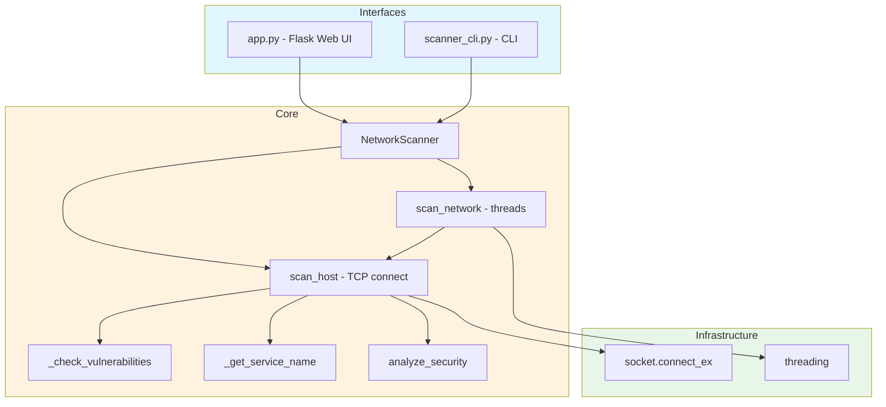

# Network Security Scanner

Scanner TCP de portas com interface web Flask e CLI. Verifica portas abertas, identifica servicos por numero de porta e sinaliza protocolos inseguros basicos (FTP, Telnet, HTTP nao-criptografado, RDP exposto).

TCP port scanner with Flask web UI and CLI. Checks open ports, identifies services by port number, and flags basic insecure protocols (FTP, Telnet, unencrypted HTTP, exposed RDP).

[](https://python.org)
[](https://flask.palletsprojects.com)
[](LICENSE)

[Portugues](#portugues) | [English](#english)

---

## Portugues

### Visao Geral

Scanner de rede TCP que usa `socket.connect_ex()` para verificar 14 portas comuns em hosts individuais ou faixas CIDR. Possui tres interfaces:

- **Interface Web** (`app.py`) — aplicacao Flask com formulario HTML para scans interativos
- **CLI** (`scanner_cli.py`) — interface de linha de comando com argparse
- **Modulo Python** (`network_scanner.py`) — classe `NetworkScanner` para uso programatico

> **Nota**: Este e um scanner de portas basico, nao um scanner de vulnerabilidades completo. A "deteccao de vulnerabilidades" consiste em avisos hardcoded para 4 portas especificas (21/FTP, 23/Telnet, 80/HTTP, 3389/RDP). Nao ha banner grabbing, fingerprinting de versao ou verificacao de CVE.

### Arquitetura


### Funcionalidades

| Funcionalidade | Descricao |
|----------------|-----------|
| Scan de host | Verifica 14 portas TCP comuns via `socket.connect_ex()` |
| Scan de rede | Varre faixas CIDR com threads (uma thread por host) |
| Identificacao de servico | Lookup estatico: numero de porta -> nome do servico |
| Alertas de seguranca | Avisos hardcoded para FTP, Telnet, HTTP, RDP |
| Score de seguranca | Calculo simples baseado na quantidade de portas abertas e alertas |
| Interface web | Formulario HTML com resultados renderizados via JavaScript |
| CLI | argparse com opcoes de porta, timeout, saida JSON/arquivo |

### Inicio Rapido

```bash
# Clonar o repositorio
git clone https://github.com/galafis/Network-Security-Scanner.git
cd Network-Security-Scanner

# Criar ambiente virtual
python -m venv venv
source venv/bin/activate  # Windows: venv\Scripts\activate

# Instalar dependencias
pip install -r requirements.txt

# Interface web (porta 5000)
python app.py

# CLI - scan de host
python scanner_cli.py 192.168.1.1

# CLI - scan de rede
python scanner_cli.py 192.168.1.0/24 --network

# CLI - portas especificas com saida JSON
python scanner_cli.py example.com --ports 80,443,8080 --json
```

### Testes

```bash
# Executar todos os testes
pytest

# Com cobertura
pytest --cov=. --cov-report=term-missing

# Testes especificos
pytest test_app.py -v
pytest test_network_scanner.py -v
```

### Estrutura do Projeto

```
Network-Security-Scanner/
├── app.py                    # Flask web app (3 rotas: /, /health, /scan)
├── network_scanner.py        # Classe NetworkScanner (scan TCP)
├── scanner_cli.py            # Interface CLI com argparse
├── config.py                 # Config basica (SECRET_KEY)
├── templates/
│   └── index.html            # UI web com CSS/JS inline
├── test_app.py               # 17 testes para rotas Flask
├── test_network_scanner.py   # 11 testes para scanner
├── Dockerfile
├── requirements.txt
├── .env.example
└── LICENSE
```

### Stack Tecnologica

| Tecnologia | Uso real |
|------------|----------|
| **Python** | Linguagem principal |
| **Flask** | Servidor web e rotas API |
| **Flask-CORS** | Politicas CORS configuraveis |
| **socket** | Conexoes TCP para scan de portas |
| **threading** | Paralelismo em scans de rede |
| **pytest** | Framework de testes (28 testes) |

---

## English

### Overview

TCP network scanner that uses `socket.connect_ex()` to check 14 common ports on individual hosts or CIDR ranges. Has three interfaces:

- **Web UI** (`app.py`) — Flask application with HTML form for interactive scans
- **CLI** (`scanner_cli.py`) — command-line interface with argparse
- **Python module** (`network_scanner.py`) — `NetworkScanner` class for programmatic use

> **Note**: This is a basic port scanner, not a full vulnerability scanner. The "vulnerability detection" consists of hardcoded warnings for 4 specific ports (21/FTP, 23/Telnet, 80/HTTP, 3389/RDP). There is no banner grabbing, version fingerprinting, or CVE checking.

### Architecture



### Features

| Feature | Description |
|---------|-------------|
| Host scan | Checks 14 common TCP ports via `socket.connect_ex()` |
| Network scan | Scans CIDR ranges with threads (one thread per host) |
| Service identification | Static lookup: port number -> service name |
| Security alerts | Hardcoded warnings for FTP, Telnet, HTTP, RDP |
| Security score | Simple calculation based on open port count and alerts |
| Web UI | HTML form with results rendered via JavaScript |
| CLI | argparse with port, timeout, JSON output, file output options |

### Quick Start

```bash
# Clone the repository
git clone https://github.com/galafis/Network-Security-Scanner.git
cd Network-Security-Scanner

# Create virtual environment
python -m venv venv
source venv/bin/activate  # Windows: venv\Scripts\activate

# Install dependencies
pip install -r requirements.txt

# Web interface (port 5000)
python app.py

# CLI - host scan
python scanner_cli.py 192.168.1.1

# CLI - network scan
python scanner_cli.py 192.168.1.0/24 --network

# CLI - specific ports with JSON output
python scanner_cli.py example.com --ports 80,443,8080 --json
```

### Testing

```bash
# Run all tests
pytest

# With coverage
pytest --cov=. --cov-report=term-missing

# Specific tests
pytest test_app.py -v
pytest test_network_scanner.py -v
```

### Project Structure

```
Network-Security-Scanner/
├── app.py                    # Flask web app (3 routes: /, /health, /scan)
├── network_scanner.py        # NetworkScanner class (TCP scan)
├── scanner_cli.py            # CLI interface with argparse
├── config.py                 # Basic config (SECRET_KEY)
├── templates/
│   └── index.html            # Web UI with inline CSS/JS
├── test_app.py               # 17 tests for Flask routes
├── test_network_scanner.py   # 11 tests for scanner
├── Dockerfile
├── requirements.txt
├── .env.example
└── LICENSE
```

### Tech Stack

| Technology | Actual usage |
|------------|-------------|
| **Python** | Core language |
| **Flask** | Web server and API routes |
| **Flask-CORS** | Configurable CORS policies |
| **socket** | TCP connections for port scanning |
| **threading** | Parallelism in network scans |
| **pytest** | Testing framework (28 tests) |

---

### Author / Autor

**Gabriel Demetrios Lafis**
- GitHub: [@galafis](https://github.com/galafis)
- LinkedIn: [Gabriel Demetrios Lafis](https://linkedin.com/in/gabriel-demetrios-lafis)

### License / Licenca

MIT License - see [LICENSE](LICENSE) for details.
